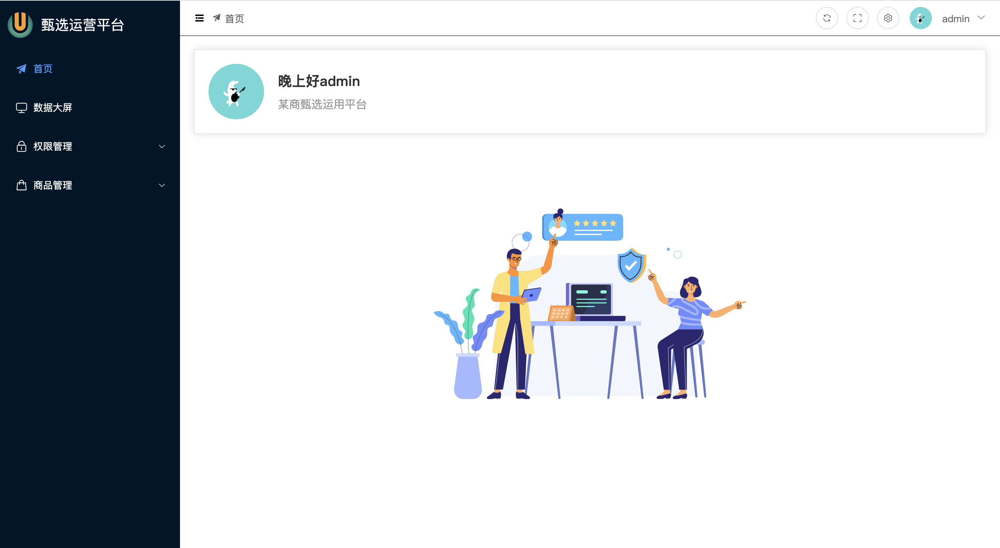
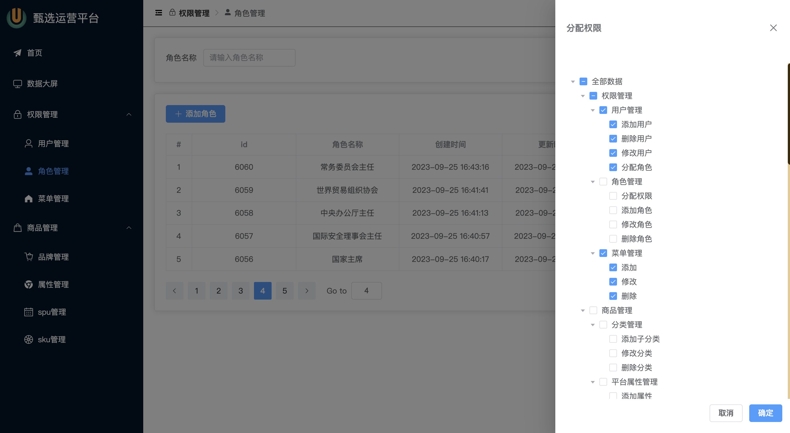
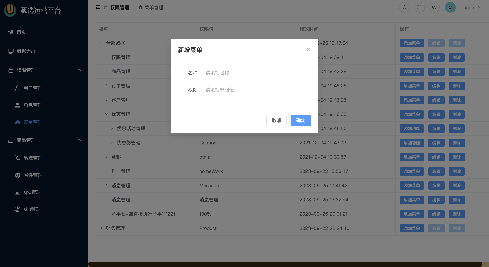
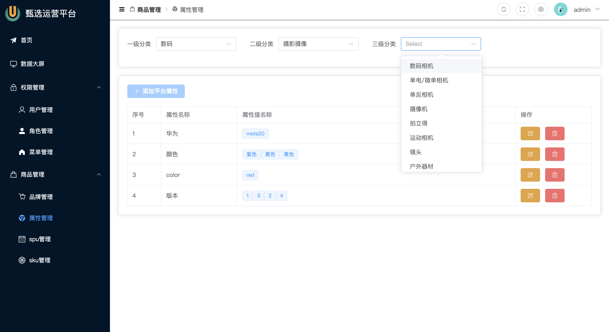
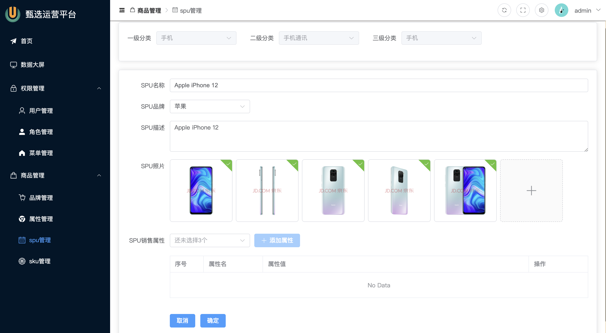
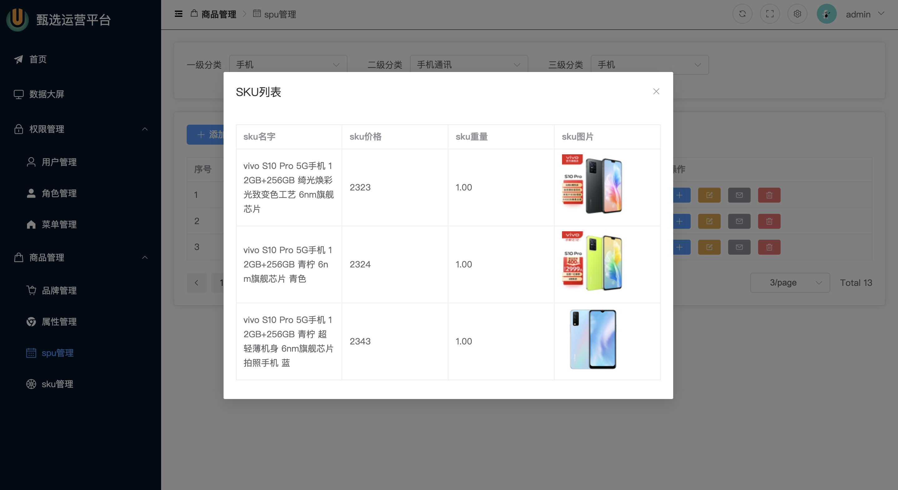
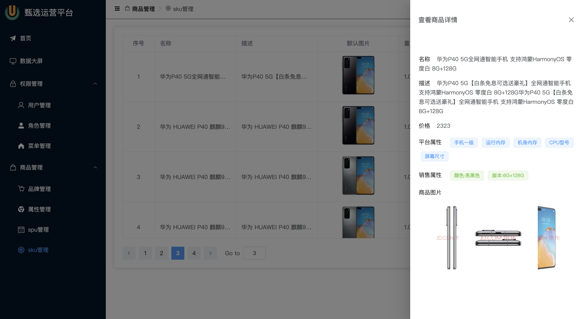
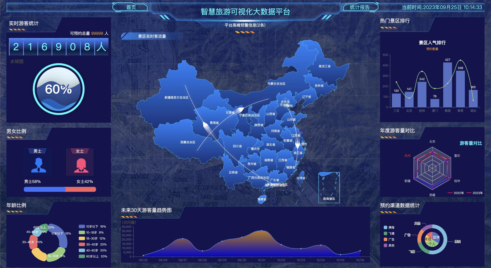

# 后台管理网站前端

后台管理网站前端项目，主要包括用户管理和商品管理。
用户管理可实现用户的创建与删除，用户权限管理等。
商品管理包括商品的创建与删除，商品属性管理，详情管理，图片管理等。
同时还有一个数据面板可以实时显示用户数量/地理位置等信息。

## 安装依赖

```
npm install
```

## 命令

开发：
```
npm run dev
```

发布：
```
npm run build
```

语法检查：
```
npm run lint:eslint
```

## 运行截图
















